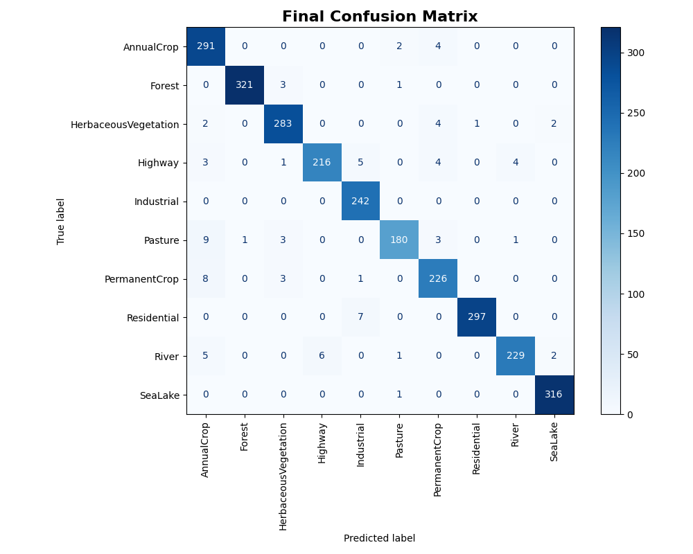
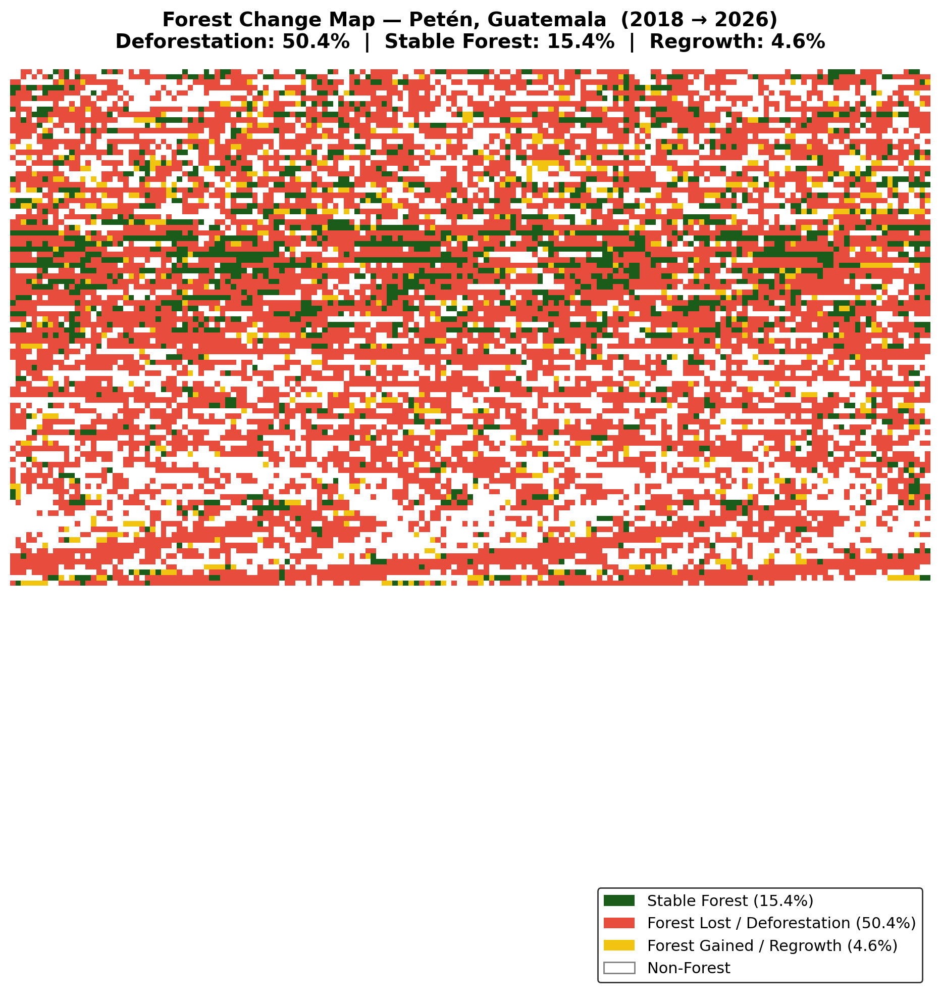

# 🌳 DeforestWatch

> Satellite-based deforestation detection using transfer learning. Fine-tunes ResNet50 on EuroSAT to classify Sentinel-2 imagery into 10 land-cover classes (98% accuracy), then applies patch-based change detection to quantify forest loss over time. Demonstrated on the Maya Forest, Petén, Guatemala (2018 → 2026).

---

## 📋 Table of Contents

- [Overview](#overview)
- [Results](#results)
- [Dataset](#dataset)
- [Model Architecture](#model-architecture)
- [Project Structure](#project-structure)
- [How to Run](#how-to-run)
- [Requirements](#requirements)
- [Limitations](#limitations)
- [Acknowledgements](#acknowledgements)
- [Author](#author)

---

## Overview

DeforestWatch is a reproducible machine learning pipeline for automated land-cover classification and deforestation change detection using freely available Sentinel-2 satellite imagery.

The project consists of three stages:

1. **Train** – Fine-tune a ResNet50 CNN on the EuroSAT RGB benchmark dataset.
2. **Classify** – Predict land-cover classes for two Sentinel-2 images acquired at different times.
3. **Detect** – Compare the generated land-cover maps to estimate forest loss and vegetation change.

The entire workflow can be reproduced using **Kaggle Notebooks (GPU)** and freely available **Copernicus Sentinel-2 imagery**.

---

## Results

### EuroSAT Classification Performance

| Metric | Score |
|--------|-------|
| Overall Accuracy | **98%** |
| Macro Precision | 0.98 |
| Macro Recall | 0.98 |
| Macro F1-Score | 0.98 |
| Test Samples | 2,688 |

### Confusion Matrix

<p align="center">
  
</p>

---

### Maya Forest Change Detection (Petén, Guatemala)

| Land Cover | 2018 | 2026 | Change |
|------------|------|------|--------|
| Forest | 61.2% | 15.4% | ▼ −45.8 pp |
| HerbaceousVegetation | 20.9% | 52.6% | ▲ +31.7 pp |
| Pasture | 11.7% | — | — |
| AnnualCrop | — | 10.9% | ▲ +10.9 pp |

Overall:

- **51.9%** Forest Loss
- **4.6%** Forest Regrowth
- **15.9%** Stable Forest

### Land Cover Maps

<p align="center">
  
</p>

### Forest Change Detection

<p align="center">
  
</p>

---

## Dataset

### Training Dataset — EuroSAT RGB

- **Source:** https://www.kaggle.com/datasets/apollo2506/eurosat-dataset
- **Images:** 27,000 RGB Sentinel-2 patches
- **Patch Size:** 64 × 64 pixels
- **Spatial Resolution:** 10 m/pixel
- **Classes:** 10 land-cover categories
- **Split:** 80% Training, 10% Validation, 10% Test (Seed = 837)

### Inference Dataset — Sentinel-2 TCI

- **Source:** https://www.kaggle.com/datasets/prananddesai/petn-deforestation-data
- **Original Provider:** Copernicus Data Space Ecosystem (ESA Sentinel-2 Level-2A)
- **Tile:** T15QYV
- **Location:** Petén, Guatemala
- **Product:** Sentinel-2 Level-2A True Colour Image (TCI)
- **Dates:** 08 January 2018 and 23 April 2026
- **Spatial Resolution:** 10 m/pixel
- **Study Area:** Approximately 114 km²
---

## Model Architecture

```
Input (64×64×3)
      │
      ▼
Resize (224×224)
      │
      ▼
Random Flip (Training Only)
      │
      ▼
ResNet50 preprocess_input
      │
      ▼
Pretrained ResNet50 Backbone
      │
      ▼
Global Average Pooling
      │
      ▼
Dense (10)
      │
      ▼
10 Land Cover Classes
```

### Training Strategy

**Phase 1**

- Freeze ResNet50 backbone
- Train classification head
- Adam Optimizer
- Learning Rate = 1e−3
- 10 Epochs

**Phase 2**

- Fine-tune upper ResNet50 layers
- BatchNorm layers kept frozen
- Adam Optimizer
- Learning Rate = 1e−5
- Early Stopping (Patience = 3)

---

## Project Structure

```
DeforestWatch/
│
├── DeforestWatch.ipynb          # Complete training & inference pipeline
├── requirements.txt
├── figures/
│   ├── confusion_matrix.png
│   ├── maya_forest_land_cover_map.png
│   └── maya_forest_change_map.png
├── README.md
└── LICENSE
```

## How to Run

### 1. Clone Repository

```bash
git clone https://github.com/pranandD/DeforestWatch.git
cd DeforestWatch
```

### 2. Install Dependencies

```bash
pip install -r requirements.txt
```

### 3. Download the EuroSAT Dataset

Download the **EuroSAT RGB** dataset from Kaggle:

https://www.kaggle.com/datasets/apollo2506/eurosat-dataset

Add the dataset to your Kaggle Notebook (or download it locally if running outside Kaggle) and update the `data_dir` variable in **DeforestWatch.ipynb** to match its location.

### 4. Train the Model

Run

```
DeforestWatch.ipynb
```

The notebook will

- Load EuroSAT
- Train ResNet50
- Evaluate the model
- Save

```
/kaggle/working/eurosat_model.keras
```

### Step 5 — Download the Sentinel-2 Dataset

Download the prepared Sentinel-2 dataset from Kaggle:

https://www.kaggle.com/datasets/prananddesai/petn-deforestation-data

Add the dataset to your Kaggle Notebook.

The notebook expects the dataset to be available at:

```
/kaggle/input/petn-deforestation-data/
```

If your dataset is mounted in a different location, simply update the `base_path` variable inside **DeforestWatch.ipynb**.

### 6. Run Change Detection

Continue executing the remaining notebook cells.

Outputs generated:

- Land Cover Maps
- Forest Change Map
- Land Cover Statistics
- Forest Loss Percentage

## Requirements

```
tensorflow>=2.10
numpy
Pillow
matplotlib
scikit-learn
```

Install

```bash
pip install -r requirements.txt
```

For JP2 support

```bash
apt-get install -y libopenjp2-7
```

---

## Limitations

- Model trained using European EuroSAT imagery; performance may vary in tropical regions.
- Predictions are made on **64 × 64 pixel patches** (approximately **640 × 640 m** on the ground), limiting the detection of very small clearings.
- Only RGB channels are used; Sentinel-2 multispectral bands (e.g., Near-Infrared) are not utilized.
- Results have not been validated using field observations.
- Seasonal differences between acquisition dates may influence land-cover predictions.

---

## Acknowledgements

- EuroSAT Dataset (Helber et al., IEEE JSTARS 2019)
- European Space Agency — Sentinel-2 Mission
- Copernicus Data Space Ecosystem
- Global Forest Watch

---

## Author

**Pranand Desai**

Computer Engineering Undergraduate

If you find this project useful, consider giving the repository a ⭐.


